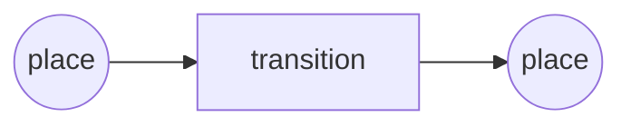
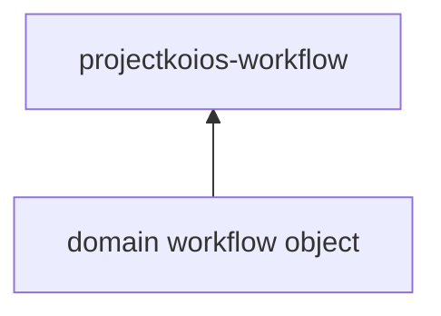

# ADR 20260702.042300: Workflow-Compatible Petri-Net Executor for projectkoios-workflow

## Status

draft

## Context

Origin: user request
From: HERMES
Acting-As: HERMES
Scope: projectkoios-bootstrap workflow package architecture
Repository: projectkoios-bootstrap
Architecture-Domain: software

Project Koios needs a workflow substrate that can define, inspect, and execute
workflows using Petri-net semantics instead of only ordered steps. A plain DAG
can express sequence, but it cannot express the runtime concepts needed for
workflow compatibility: places, tokens, enabled transitions, markings, guards,
restartable execution state, or event traces.

This decision is motivated by two requirements:

1. domain packages should define concrete workflows against a shared execution
   substrate
2. the workflow substrate should remain minimal, inspectable, and compatible
   with future analysis, simulation, and orchestration backends

There is also existing Petri-net-related work in Project Koios, including the
read-only colored Petri net handoff evaluator. That work proves the value of
Petri-net reasoning, but it is not a general workflow executor. This ADR defines
the general workflow substrate the other artifacts can build against.

## Decision

Create `src/python/projectkoios/workflow` as the minimal workflow execution
substrate for Project Koios.

The package should define the workflow language and execution machinery, while
client/domain packages define concrete workflows using that language.

The canonical internal model must include:

- `Place`
- `Transition`
- `Token`
- `Marking`
- `WorkflowNet`
- `Orchestrator`
- `ExecutionState`
- `Event`
- `Arc`
- `Guard`
- `Binding`
- `FiringRule`
- `NetSchema`
- `ExecutionTrace`
- `EventLog`

For Project Koios workflow automation, the preferred semantic layer should also
include the following domain-neutral concepts:

- `DataObject`
- `ActivityObject`
- `AgentObject`
- `WorkspaceObject`
- `ArtifactObject`
- `PermissionObject`

These semantic objects should map onto Petri-net primitives without making the
workflow package the owner of any particular domain.

The package boundary is:

- domain packages define workflow objects
- the workflow object declares a Petri net with triggers, places, transitions,
  token types, and terminal endpoints
- `projectkoios.workflow` validates that the object satisfies the workflow
  schema
- `projectkoios.workflow` advances the marking by firing enabled transitions
- the payload belongs to the domain package
- the execution semantics belong to `projectkoios.workflow`

The existing read-only Petri-net-related code under
`src/python/projectkoios/bootstrap/harness/` should be migrated or wrapped so
its behavior is preserved while the new package becomes the canonical workflow
substrate.

The package must provide:

- workflow representation
- execution semantics
- runtime state
- event emission
- restart support
- inspection of the current net, marking, enabled transitions, and execution
  history

The package must not provide:

- domain-specific workflows
- artifact provenance modeling beyond emitted execution events
- Obsidian automation logic
- scientific simulation logic
- reporting logic

The internal Petri-net model must be encapsulated behind adapters. No
application code may import external Petri-net packages directly.

Start with two adapters only:

- `SnakesColoredNetAdapter` for execution semantics
- `Pm4pyProcessMiningAdapter` for analysis, event logs, conformance, discovery,
  and visualization

Defer `SimPN` until simulation metrics matter. Defer `PNet` unless text-based
Petri-net authoring becomes a real requirement.

## Consequences

- Project Koios gains a minimal execution substrate that is explicit about
  workflow state and runtime movement.
- Domain packages can define workflows without depending on each other.
- The workflow package stays small enough to inspect, test, and adapt.
- External Petri-net packages remain swappable behind adapters.
- The current read-only handoff evaluator can continue to exist as a specific
  legacy-compatible use case without becoming the whole workflow layer.

## architecture-spec

The workflow substrate is a Petri-net execution package with a minimal IR and
adapter-based backends.

### Core model

**Figure.** The core workflow unit is a transition between places. Tokens
occupy places. Transitions move tokens by firing.

### Package boundary

**Figure.** Domain workflow objects depend on the workflow package. The
workflow package should not depend on domain packages.

### Required abstractions

| abstraction | meaning |
|---|---|
| `Place` | workflow state, condition, queue, resource, or data-product location |
| `Transition` | an operation that may fire when its input conditions are satisfied |
| `Token` | an item carried by the workflow, such as an artifact, job, approval, dataset, or resource marker |
| `Marking` | the current distribution of tokens over places |
| `WorkflowNet` | a collection of places, transitions, arcs, and rules |
| `Orchestrator` | the runtime component that advances the workflow by firing enabled transitions |
| `ExecutionState` | the current runtime state of a workflow instance |
| `Event` | a record that something happened during execution |

### Minimal responsibility

| responsibility | description |
|---|---|
| workflow representation | define places, transitions, tokens, arcs, markings, and workflow nets |
| execution semantics | determine enabled transitions and fire transitions |
| runtime state | track the current marking and workflow status |
| event emission | emit structured events during execution |
| restart support | allow workflow state to be saved and resumed |
| inspection | expose the current net, marking, enabled transitions, and execution history |

### Encapsulated engines

| adapter | backend | role |
|---|---|---|
| `SnakesColoredNetAdapter` | SNAKES | canonical Colored Petri Net execution |
| `Pm4pyProcessMiningAdapter` | PM4Py | process mining, event logs, conformance, discovery, visualization |
| `SimpnSimulationAdapter` | SimPN | deferred discrete-event simulation and queue/resource modeling |
| `PnetTextAdapter` | PNet | deferred optional text-model import/export experiment |

### Architectural rule

No application code may import external Petri-net packages directly. Allowed
imports live only in adapter modules.

### YAGNI decision

Start with two adapters only:

1. `SnakesColoredNetAdapter`
2. `Pm4pyProcessMiningAdapter`

Defer SimPN until simulation metrics matter. Defer PNet unless text-based
Petri-net authoring becomes a real requirement.

## acceptance-criteria

- A domain package can define a workflow object against the shared substrate.
- The substrate validates workflow objects before execution.
- The substrate can advance a marking by firing enabled transitions.
- Execution state and event history can be inspected and resumed.
- The internal model includes the required abstractions above.
- External Petri-net packages are used only through adapters.
- The first implementation slice uses only SNAKES and PM4Py.
- SimPN and PNet remain deferred.
- Existing handoff/evaluator behavior remains covered by regression tests after
  migration.

## implementation-brief

If accepted, create the `src/python/projectkoios/workflow` package boundary,
implement the canonical Petri-net IR, implement the execution/orchestration
runtime, and add adapter modules for SNAKES and PM4Py behind the package API.
Migrate the existing read-only handoff/evaluator code under
`src/python/projectkoios/bootstrap/harness/` into the new framework or wrap it
behind compatibility shims so existing behavior remains testable.

## resolved_open_questions

- Should the workflow package live in the mothership repo or be scaffolded here
  first as an extracted contract?
- Should `EventLog` be persisted as a first-class artifact or only emitted for
  inspection?
- Should `Binding` and `FiringRule` be explicit public types or internal
  runtime helpers?
- Should restart support include checkpoint serialization from the first slice,
  or only in-memory resume for the initial implementation?

## non_goals

- Domain-specific workflow definition inside the substrate
- Direct imports of third-party Petri-net libraries outside adapters
- Broad simulation metrics in the first slice
- Multi-repo orchestration semantics beyond the workflow substrate
- Obsidian automation logic
- Scientific/modeling package behavior
- Reporting systems

## validation-expectations

- A sample domain workflow can be defined and validated against the schema.
- Enabled transitions can be computed from a marking.
- Firing a transition changes the marking and emits an event.
- Execution history can be inspected after multiple firings.
- The adapter boundary prevents direct third-party Petri-net imports outside
  the adapter modules.
- The first slice runs with SNAKES and PM4Py only.

## routing

- Owner: Athena
- Next phase: proposed
- Notes: Workflow substrate architecture; preserve Petri-net semantics, package
  boundary, adapter encapsulation, and YAGNI deferrals.

## links

- back_to: architecture.00
- supersedes: None
- superseded_by: None

## Comments

- KOIOS: Preserve the clear separation between workflow substrate and domain
  workflows; otherwise the package will accrete policy.
- VULCAN: The adapter split is right, but the first implementation slice should
  include a concrete persistence story for restart support so the executor is
  actually resumable, not just inspectable.
- HERMES: Existing bootstrap harness code should be migrated with regression
  tests, not rewritten as a greenfield package that drops current behavior.
- HERMES: The restart/persistence boundary needs to be explicit in the first
  slice; otherwise the Petri-net substrate will be hard to prove operationally.
